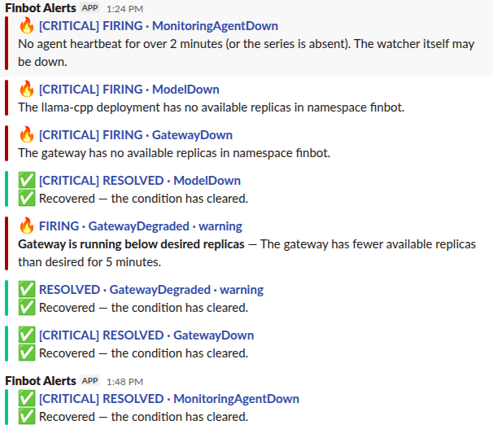

# Finbot MLOps — a production-style GitOps platform on a local kind cluster

Finbot is a finance-education LLM served as a full production-style platform: a fine-tuned model behind a
resilient API gateway, deployed and continuously reconciled with GitOps, watched by a two-path monitoring
system that can even detect its own failure. The whole thing runs **locally on a three-node kind cluster**,
so you can stand up the entire stack on one laptop and prove every production pattern end to end before
ever paying for cloud infrastructure.

This README tells the full story, component by component (0–8), explains what each one does and why, and
gives every command needed to build, deploy, and verify it.

> **Runs on local kind.** Every node is a Docker container on one machine. This is deliberate: kind gives
> real node pinning, real GitOps, real monitoring, and real fault simulation at zero cost. The same
> manifests move to real infrastructure later by swapping only the cluster layer.

---

## What you end up with

- A **3-node Kubernetes cluster** (kind) with workloads pinned to dedicated nodes.
- **GitOps**: Argo CD deploys everything from Git; the cluster always matches the repo.
- **Encrypted secrets in Git** via Sealed Secrets.
- **Redis** as shared state.
- **Prometheus + Alertmanager** monitoring stack.
- A **fine-tuned model** (Qwen3-1.7B, GGUF) served with llama.cpp.
- A **resilient API gateway** (FastAPI) with auth, rate limiting, caching, retries, and a circuit breaker.
- **Alerting to Slack** with state-aware messages and a dead-man switch.
- A **LangGraph monitoring agent** that explains incidents with an LLM and emits a heartbeat.

### The monitoring, proven in Slack

Both alerting paths, firing and resolving, with correctly-worded recovery messages and the dead-man switch
catching the missing agent (then clearing when it came up):



---

## The components

### Component 0 — Kubernetes cluster

Terraform creates a three-node kind cluster. Each node has a role label, and the model and agent nodes are
tainted so only their intended workloads land there.

| Node | Label | Purpose |
| --- | --- | --- |
| `finbot-control-plane` | `node-role=infra` | Argo CD, gateway, Redis, monitoring |
| `finbot-worker` | `node-role=model` | llama.cpp and the GGUF model |
| `finbot-worker2` | `node-role=agent` | the LangGraph monitoring agent |

This gives real node pinning: heavy model inference is isolated from the gateway and monitoring. On kind
the isolation is simulated (all nodes share the laptop's CPU/RAM), but the scheduling behaviour is real.

### Component 1 — Argo CD GitOps

Argo CD watches the Git repository and keeps the cluster synchronized with it, using the App-of-Apps
pattern:

```text
root application
  -> reads Application files from argocd/apps/
  -> each child Application points to its workload manifests
  -> Argo CD deploys those manifests to Kubernetes
```

The core idea: **you never `kubectl apply` your workloads.** You push to Git, and Argo makes the cluster
match. Git is the single source of truth.

### Component 2 — Sealed Secrets

Sealed Secrets lets encrypted credentials live safely in Git. You encrypt a plaintext Secret with the
controller's public key; only the in-cluster controller (holding the private key) can decrypt it.

```text
plaintext Secret (kept off Git)
  -> kubeseal encrypts with the controller public key
  -> encrypted SealedSecret committed to Git
  -> Argo CD deploys it
  -> controller decrypts inside the cluster
  -> pods use the resulting Kubernetes Secret
```

Never commit plaintext secrets. A fresh cluster gets a new key, so re-seal after each recreate.

### Component 3 — Redis

Redis provides shared state for the gateway (rate-limit counters, response cache) and the agent (incident
state). It runs as a one-replica StatefulSet with a 1 GiB PVC, a headless Service `redis` for identity,
and a ClusterIP `redis-svc:6379` for clients. Persistent, but not HA — production HA would add replication
and failover.

### Component 4 — Monitoring stack

The `kube-prometheus-stack` Helm chart provides Prometheus and Alertmanager (Grafana is disabled locally to
save memory). Installed via a multi-source Argo Application: the chart from the `prometheus-community` repo,
values from this repo (`helm/kube-prometheus-stack/values-kind.yaml`).

The values file carries the local tuning: predictable service names (`kps-prometheus`, `kps-alertmanager`),
the built-in noisy rules disabled, selectors that let Prometheus discover this project's own
ServiceMonitors and rules, and — importantly — the **Alertmanager Slack routing and templates inline**
(not a separate CRD, which avoids an operator-injected namespace matcher that would silently drop alerts).

### Component 5 — Model serving

The fine-tuned model runs with llama.cpp on the model node (Node B). An init container downloads the GGUF
once into a PVC and skips the download if it's already there, so restarts reuse the cache. The pod is
pinned to Node B (nodeSelector + toleration), uses a generous startup probe (model loading is slow), and
serves an OpenAI-compatible API on `llama-cpp-svc:8080`. CPU-only inference, tuned small for local testing.

### Component 6 — API gateway

The gateway is the front door and a **policy-and-resilience layer, not a second inference engine** — it
governs and protects access to the model but never does the model's work.

- **Policy:** auth (Bearer key from the sealed secret), request validation, rate limiting (Redis),
  response caching (Redis).
- **Resilience:** timeouts, bounded retries, a circuit breaker that fails fast when the model is
  unhealthy, and clean JSON errors instead of stack traces.

It's stateless, so it's spread across nodes (not pinned), runs two replicas, and scales with an HPA. Served
as `fastapi-gateway-svc:8000`.

### Component 7 — Monitoring configuration

This turns the metrics the model and gateway emit into actual alerts. It's the PrometheusRules — the alert
conditions:

- **Availability:** `ModelDown`, `GatewayDown`, `GatewayDegraded`, measuring readiness (`replicas_available < 1`),
  and handling the metric going **absent** (a deployment scaled to 0 stops reporting, so the rule uses
  `or absent(...)`).
- **Errors:** `GatewayHighErrorRate` when the 5xx ratio exceeds 10%.
- **Dead-man switch:** `MonitoringAgentDown` — fires if the agent's heartbeat goes stale **or disappears**.

The Alertmanager side (routing, Slack receivers, state-aware templates) lives in the monitoring values from
Component 4. The templates gate both the title and body on the alert's status, so a resolved notification
reads "Recovered", never "is down".

### Component 8 — Monitoring agent

The LangGraph agent on Node C adds intelligence on top of the reliable alerting path. Its governing rule:
**the LLM explains problems; it never becomes the only detector, and it never fixes infrastructure.** That
is enforced structurally — detection uses fixed PromQL and deterministic thresholds, and the agent's
Kubernetes access is strictly read-only (RBAC allows only get/list/watch).

Each cycle it reads Prometheus, probes the gateway and model, classifies health, correlates incidents,
explains **new** ones with an LLM, notifies Slack (its own Path 2), persists state in Redis, and emits the
heartbeat the dead-man switch watches. Once it runs, `MonitoringAgentDown` stops firing — the watcher is
watched.

### The two Slack paths

- **Path 1** — Prometheus rule → Alertmanager → Slack. Reliable; works even if the agent is down; waits out
  a `for:` window so it only fires on sustained problems.
- **Path 2** — the agent → LLM explanation → Slack. Fast (polls every 30s) and context-rich, but depends on
  the agent running.

They can legitimately disagree on brief events: a model outage that self-heals in 30 seconds is caught by
the fast agent but not by the deliberate 2-minute Alertmanager rule. That divergence is by design.

---

## Repository structure

```text
finbot-mlops/
├── infra/
│   ├── kind/kind-cluster.yaml
│   └── terraform/                     # main, variables, outputs, versions .tf
├── argocd/
│   ├── apps/                          # one Application per component
│   │   ├── namespace.yaml
│   │   ├── sealed-secrets-controller.yaml
│   │   ├── sealed-secret-manifests.yaml
│   │   ├── redis.yaml
│   │   ├── monitoring-namespace.yaml
│   │   ├── monitoring.yaml
│   │   ├── model.yaml
│   │   ├── gateway.yaml
│   │   ├── monitoring-config.yaml
│   │   └── agent.yaml
│   ├── bootstrap/                     # root-app + install
│   └── projects/finbot-project.yaml
├── secrets/
│   ├── seal-secret.sh
│   └── sealed/                        # encrypted SealedSecrets (safe in Git)
├── helm/
│   └── kube-prometheus-stack/values-kind.yaml
├── services/                          # containerized services (code + Dockerfile)
│   ├── gateway/                       # FastAPI policy + resilience layer
│   └── agent/                         # LangGraph monitoring agent
└── deploy/base/                       # Kubernetes manifests
    ├── namespace/  sealed-secrets/  redis/
    ├── monitoring-namespace/  model/  gateway/
    ├── monitoring-config/             # PrometheusRules
    └── agent/                         # deployment, service, servicemonitor, rbac
```

---

## Prerequisites

- Docker with at least 12 GB RAM available
- kind, kubectl, Terraform 1.5+, kubeseal
- A Git repository Argo CD can read

Push the repo to Git before installing Argo CD — Argo reads from Git, not your laptop's files.

> A fresh cluster gets a new Sealed Secrets key, so re-seal after each recreate. Locally built images are
> sideloaded into kind and don't survive a recreate either, so rebuild/re-import them too.

---

## Component 0 — Create the cluster

```bash
cd infra/terraform
terraform init
terraform apply -auto-approve
```

Reserve the worker nodes and keep the control-plane schedulable:

```bash
kubectl taint node finbot-worker  dedicated=model:NoSchedule --overwrite
kubectl taint node finbot-worker2 dedicated=agent:NoSchedule --overwrite
kubectl taint node finbot-control-plane node-role.kubernetes.io/control-plane- 2>/dev/null || true
```

Verify nodes, labels, and taints:

```bash
kubectl get nodes -L node-role \
  -o custom-columns='NODE:.metadata.name,ROLE:.metadata.labels.node-role,TAINTS:.spec.taints[*].key'
```

Expected: control-plane = `infra` (no taint), worker = `model` (taint `dedicated`), worker2 = `agent`
(taint `dedicated`).

---

## Component 1 — Install Argo CD

Set your real Git URL in `argocd/bootstrap/root-app.yaml`, `argocd/projects/finbot-project.yaml`, and every
Application under `argocd/apps/`. Commit and push first.

```bash
kubectl create namespace argocd

# server-side apply avoids the "annotations: Too long" CRD error
kubectl apply -n argocd --server-side --force-conflicts \
  -f https://raw.githubusercontent.com/argoproj/argo-cd/stable/manifests/install.yaml
kubectl -n argocd rollout status deploy/argocd-server --timeout=300s

# hand control to Git
kubectl apply -f argocd/projects/finbot-project.yaml
kubectl apply -f argocd/bootstrap/root-app.yaml
```

Verify and open the UI:

```bash
kubectl -n argocd get applications
kubectl -n argocd get secret argocd-initial-admin-secret \
  -o jsonpath='{.data.password}' | base64 -d; echo
kubectl -n argocd port-forward svc/argocd-server 8081:443   # https://localhost:8081  (user: admin)
```

---

## Component 2 — Sealed Secrets

Install kubeseal (Linux AMD64):

```bash
KUBESEAL_VERSION=0.27.1
curl -fsSL -o kubeseal.tar.gz \
  "https://github.com/bitnami-labs/sealed-secrets/releases/download/v${KUBESEAL_VERSION}/kubeseal-${KUBESEAL_VERSION}-linux-amd64.tar.gz"
tar xzf kubeseal.tar.gz kubeseal && sudo install kubeseal /usr/local/bin/ && rm kubeseal kubeseal.tar.gz
```

Push the controller (a vendored static manifest, not a Helm/OCI chart) and secrets structure:

```bash
git add argocd/ deploy/base/sealed-secrets/ secrets/
git commit -m "Component 2: Sealed Secrets" && git push
kubectl apply -f argocd/projects/finbot-project.yaml   # AppProject changes need a manual apply
kubectl -n argocd patch application finbot-root --type merge \
  -p '{"metadata":{"annotations":{"argocd.argoproj.io/refresh":"hard"}}}'
```

Seal your secrets (example for the gateway key), listing encrypted files in
`secrets/sealed/kustomization.yaml` as a normal YAML list:

```bash
cat > /tmp/gateway-secret.yaml <<'YAML'
apiVersion: v1
kind: Secret
metadata: { name: gateway-secret, namespace: finbot }
type: Opaque
stringData: { GATEWAY_API_KEY: "your-real-strong-key" }
YAML
cd secrets && ./seal-secret.sh /tmp/gateway-secret.yaml sealed/gateway-sealed.yaml && rm /tmp/gateway-secret.yaml && cd ..
```

Seal `model-secret`, `agent-secret` (with `SLACK_WEBHOOK`, `OPENAI_API_KEY`, `GATEWAY_API_KEY`), and defer
the `alertmanager-slack` secret until Component 4 (its namespace doesn't exist yet). Commit only the
encrypted files. Verify:

```bash
kubectl -n finbot get secrets     # gateway-secret, model-secret, agent-secret
```

---

## Component 3 — Redis

```bash
git add deploy/base/redis/ argocd/apps/redis.yaml
git commit -m "Component 3: Redis" && git push
kubectl -n argocd patch application finbot-root --type merge \
  -p '{"metadata":{"annotations":{"argocd.argoproj.io/refresh":"hard"}}}'

kubectl -n finbot get pods -l app=redis -o wide
kubectl -n finbot exec -it redis-0 -- redis-cli ping     # PONG
```

---

## Component 4 — Monitoring stack

Re-enable the deferred Alertmanager Slack secret in `secrets/sealed/kustomization.yaml`, and make sure the
AppProject `clusterResourceWhitelist` allows the admission-webhook resources the chart installs:

```yaml
- group: admissionregistration.k8s.io
  kind: MutatingWebhookConfiguration
- group: admissionregistration.k8s.io
  kind: ValidatingWebhookConfiguration
```

Deploy:

```bash
git add helm/ deploy/base/monitoring-namespace/ argocd/apps/monitoring*.yaml \
        argocd/projects/finbot-project.yaml secrets/sealed/kustomization.yaml
git commit -m "Component 4: monitoring stack" && git push
kubectl apply -f argocd/projects/finbot-project.yaml
kubectl -n argocd patch application finbot-root --type merge \
  -p '{"metadata":{"annotations":{"argocd.argoproj.io/refresh":"hard"}}}'
```

Verify and reach the UIs (use the `kps-` service names):

```bash
kubectl -n monitoring get pods                                       # prometheus + alertmanager Running
kubectl -n monitoring port-forward svc/kps-prometheus   9090:9090    # http://localhost:9090
kubectl -n monitoring port-forward svc/kps-alertmanager 9093:9093    # http://localhost:9093
```

---

## Component 5 — Model serving

Confirm the GGUF filename matches your Hugging Face file in `deploy/base/model/deployment.yaml` (the init
container's `MODEL_FILE` and the server's `-m` arg must match).

```bash
git add deploy/base/model/ argocd/apps/model.yaml
git commit -m "Component 5: model server" && git push
kubectl -n argocd patch application finbot-root --type merge \
  -p '{"metadata":{"annotations":{"argocd.argoproj.io/refresh":"hard"}}}'
```

Watch the slow first run (downloads ~2 GB, then loads), then test:

```bash
kubectl -n finbot get pods -l app=llama-cpp -o wide          # lands on the model node
kubectl -n finbot logs -l app=llama-cpp -c fetch-model        # download (first run only)

kubectl -n finbot port-forward --address 127.0.0.1 svc/llama-cpp-svc 9080:8080
curl http://127.0.0.1:9080/v1/chat/completions -H 'Content-Type: application/json' \
  -d '{"messages":[{"role":"user","content":"What is compound interest?"}],"max_tokens":128}'
```

> Port 8080 on the host is taken by kind, so forward to a free port like 9080. If curl resets on
> `localhost`, it's an IPv4/IPv6 mismatch — use `--address 127.0.0.1`, or curl `http://[::1]:9080`.

---

## Component 6 — API gateway

Build and sideload the image (kind's `kind load` can fail with a containerd-snapshotter error; the tar +
`ctr import` route is reliable):

```bash
docker build -t finbot-gateway:local services/gateway
docker save finbot-gateway:local -o /tmp/gateway.tar
docker exec -i finbot-control-plane \
  ctr --namespace=k8s.io images import --snapshotter=overlayfs - < /tmp/gateway.tar
docker exec finbot-control-plane crictl images | grep finbot-gateway
```

Set the deployment to the local image name shown by `crictl` with `imagePullPolicy: Never`. Install
metrics-server for the HPA:

```bash
kubectl apply -f https://github.com/kubernetes-sigs/metrics-server/releases/latest/download/components.yaml
kubectl -n kube-system patch deployment metrics-server --type=json \
  -p='[{"op":"add","path":"/spec/template/spec/containers/0/args/-","value":"--kubelet-insecure-tls"}]'
```

Deploy and test through the gateway:

```bash
git add services/gateway/ deploy/base/gateway/ argocd/apps/gateway.yaml
git commit -m "Component 6: API gateway" && git push
kubectl -n argocd patch application finbot-root --type merge \
  -p '{"metadata":{"annotations":{"argocd.argoproj.io/refresh":"hard"}}}'

kubectl -n finbot get hpa gateway                              # cpu %/70% once metrics-server is up
KEY=$(kubectl -n finbot get secret gateway-secret -o jsonpath='{.data.GATEWAY_API_KEY}' | base64 -d)
kubectl -n finbot port-forward --address 127.0.0.1 svc/fastapi-gateway-svc 8000:8000
curl http://127.0.0.1:8000/v1/chat/completions \
  -H "Authorization: Bearer $KEY" -H 'Content-Type: application/json' \
  -d '{"messages":[{"role":"user","content":"hi"}],"max_tokens":16}'
#   no key -> 401 ;  hammer it -> 429 ;  repeat -> x-cache: HIT
```

---

## Component 7 — Monitoring configuration

The alert rules live in `deploy/base/monitoring-config/prometheus-rules.yaml`; the Alertmanager Slack config
is in the Component 4 values (inline, not a separate CRD).

```bash
git add deploy/base/monitoring-config/ argocd/apps/monitoring-config.yaml \
        helm/kube-prometheus-stack/values-kind.yaml
git commit -m "Component 7: alert rules + Alertmanager Slack" && git push
kubectl -n argocd patch application monitoring --type merge \
  -p '{"metadata":{"annotations":{"argocd.argoproj.io/refresh":"hard"}}}'
kubectl -n argocd patch application finbot-root --type merge \
  -p '{"metadata":{"annotations":{"argocd.argoproj.io/refresh":"hard"}}}'
```

Test the full cycle (mind the timing — the model must stay down past the `for: 2m` window; scaling to 0
makes the metric vanish, which the `absent()` clause handles):

```bash
kubectl -n finbot scale deploy/llama-cpp --replicas=0
# wait ~2.5 min, confirm firing, THEN scale back:
kubectl -n monitoring exec prometheus-kps-prometheus-0 -c prometheus -- \
  wget -qO- 'http://localhost:9090/api/v1/query?query=ALERTS{alertname="ModelDown"}' \
  2>/dev/null | grep -o '"alertstate":"[^"]*"'
kubectl -n finbot scale deploy/llama-cpp --replicas=1
```

Slack should show `FIRING · ModelDown` then `RESOLVED · ModelDown` ("Recovered — the condition has
cleared"), exactly as in the screenshot above.

---

## Component 8 — Monitoring agent

Build and sideload onto **Node C** (the agent's node), confirm the sealed `agent-secret` has all three keys,
then deploy:

```bash
docker build -t finbot-agent:local services/agent
docker save finbot-agent:local -o /tmp/agent.tar
docker exec -i finbot-worker2 \
  ctr --namespace=k8s.io images import --snapshotter=overlayfs - < /tmp/agent.tar

git add services/agent/ deploy/base/agent/ argocd/apps/agent.yaml
git commit -m "Component 8: monitoring agent" && git push
kubectl -n argocd patch application finbot-root --type merge \
  -p '{"metadata":{"annotations":{"argocd.argoproj.io/refresh":"hard"}}}'
```

Verify it runs on Node C, heartbeats, and silences the dead-man alert:

```bash
kubectl -n finbot get pods -l app=agent -o wide          # on the agent node
kubectl -n finbot logs -l app=agent --tail=20            # clean cycles

kubectl -n monitoring exec prometheus-kps-prometheus-0 -c prometheus -- \
  wget -qO- 'http://localhost:9090/api/v1/query?query=monitoring_agent_heartbeat_timestamp_seconds' \
  2>/dev/null | grep -o '"value":\[[^]]*\]'                # recent timestamp

kubectl -n monitoring exec prometheus-kps-prometheus-0 -c prometheus -- \
  wget -qO- 'http://localhost:9090/api/v1/query?query=ALERTS{alertname="MonitoringAgentDown"}' \
  2>/dev/null | grep -o '"alertstate":"[^"]*"'             # empty = resolved
```

> The agent runs on Node C, so the image must be imported into `finbot-worker2` (not just the control
> plane), or the pod gets `ErrImageNeverPull`. The config is baked into the image, so a config change needs
> a rebuild + re-import + pod restart.

---

## Useful Argo CD commands

```bash
# all apps at a glance
kubectl -n argocd get applications \
  -o custom-columns='APP:.metadata.name,SYNC:.status.sync.status,HEALTH:.status.health.status'

# force a sync now
kubectl -n argocd patch application <app> --type merge \
  -p '{"metadata":{"annotations":{"argocd.argoproj.io/refresh":"hard"}}}'

# an app's error
kubectl -n argocd get application <app> \
  -o jsonpath='{range .status.conditions[*]}{.type}: {.message}{"\n"}{end}'
```

## Resource-pressure diagnostics (kind on one laptop)

Everything shares the host's CPU, so bursts can briefly starve the control plane (`etcdserver: request
timed out`). These are usually transient — check actual usage before assuming the worst:

```bash
docker stats --no-stream                              # per-node cpu + memory
kubectl top pods -A --sort-by=cpu | head -15           # which pod is busy (needs metrics-server)
kubectl get nodes                                      # still Ready?
```

If usage is low, wait a few seconds and retry. To free room while testing one part, park the model:
`kubectl -n finbot scale deploy/llama-cpp --replicas=0` (bring it back with `--replicas=1`).

---

## Stop and recreate

```bash
cd infra/terraform && terraform destroy -auto-approve
```

If destroy fails on stuck/`Dead` containers:

```bash
kind delete cluster --name finbot
docker ps -a --filter "label=io.x-k8s.kind.cluster=finbot" -q | xargs -r docker rm -f
terraform state rm kind_cluster.finbot 2>/dev/null
docker system prune -f
terraform apply -auto-approve
```

A recreated cluster needs re-sealed secrets and re-imported local images.

---

## What this project demonstrates

The differentiating skill here is the platform, not the code. An LLM can write both the YAML and the
Python; the production expertise is understanding **why** it's built this way and debugging it when it
breaks — why the sealed-secrets controller needs a vendored manifest, why the dead-man rule needs
`absent()`, why an inline Alertmanager config avoids a namespace matcher, why a metric disappears when a
deployment scales to zero, why the two Slack paths disagree on brief events. Every one of those was a real
problem solved while building this on a single laptop.

It runs entirely on local kind today. The same manifests move to real infrastructure by swapping only the
cluster layer — the workloads, GitOps, secrets, monitoring, and alerting all carry over unchanged.
